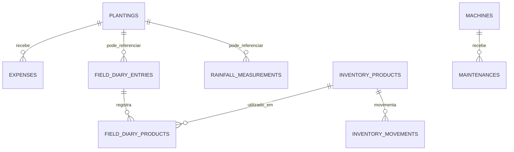

# Modelo do banco de dados

Este arquivo resume o banco atual do AgroGestor. As migrations em `src/main/resources/db/migration` continuam sendo a fonte oficial da estrutura.

## Relações principais

## Tabelas em uso

### `usuarios`

Armazena nome, e-mail normalizado, hash da senha e perfil de acesso. O e-mail possui unicidade sem diferenciar letras maiúsculas e minúsculas.

### `plantings`

Guarda cultura, safra, área, data de plantio, variedade da semente, quantidade de sementes e status. A safra aceita um ano (`2026`) ou um intervalo (`2026/2027`).

O campo de status separa plantios ativos de plantios colhidos, permitindo manter histórico sem apagar dados financeiros ou operacionais.

### `expenses`

Registra gastos financeiros ligados a um plantio. O vínculo usa restrição para evitar exclusão acidental de uma safra com histórico de custos.

### `inventory_products`

Mantém o saldo atual de sementes, fertilizantes, defensivos e outros insumos. Também guarda unidade de medida, estoque mínimo e validade. Quantidade e limite mínimo não podem ser negativos.

### `inventory_movements`

Registra entradas e saídas do estoque. A atualização do saldo e a criação da movimentação acontecem dentro da mesma transação.

### `field_diary_entries`

Centraliza acontecimentos da propriedade. O plantio é opcional para registros gerais, como compra de produto, chuva, manutenção ou observação. Para colheita, o frontend e o service exigem plantio selecionado.

Essa tabela também guarda data, tipo de atividade, condição do tempo, descrição e observações.

### `field_diary_products`

Relaciona uma atividade do diário aos produtos do estoque. É usada principalmente para registros de uso de produto, permitindo baixar automaticamente a quantidade aplicada.

### `rainfall_measurements`

Guarda medições manuais de chuva em milímetros. O registro pode ser geral da propriedade ou vinculado a um plantio.

### `machines`

Armazena marca, modelo, ano e horímetro atual da máquina.

### `maintenances`

Registra manutenção preventiva ou corretiva, peças trocadas, custo e horímetro previsto para a próxima revisão.

### `weather_location`

Tabela mantida por compatibilidade com migrations antigas. O módulo de previsão do tempo está pausado e a aplicação não consulta essa tabela no fluxo atual.

## Convenções

- IDs usam UUID.
- Valores financeiros e quantidades usam `NUMERIC`.
- Datas operacionais usam `DATE`.
- Datas de auditoria usam `TIMESTAMPTZ`.
- Mudanças estruturais entram somente por novas migrations do Flyway.
- Migrations já aplicadas não devem ser reescritas ou removidas.

## Próximas evoluções de banco

- Adicionar `property_id` para suportar múltiplas propriedades.
- Criar tabelas de backup/exportação, caso o sistema evolua para uso local/offline.
- Persistir relatórios de fechamento de safra quando houver necessidade de auditoria histórica.
