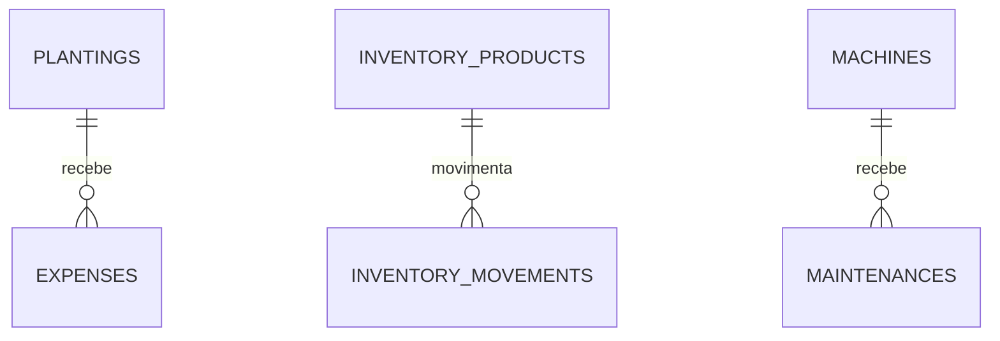

# Banco de dados

Este arquivo é um mapa rápido do banco atual. As migrations continuam sendo a fonte
oficial da estrutura.

## Relações

## Tabelas em uso

### `plantings`

Guarda cultura, safra, área, data de plantio, variedade e quantidade de sementes. A
safra aceita um ano (`2026`) ou um intervalo (`2026/2027`).

### `expenses`

Cada gasto pertence a um plantio. O vínculo usa `ON DELETE RESTRICT` para evitar que
uma safra com histórico financeiro seja removida por acidente.

### `inventory_products`

Mantém o saldo atual de sementes, fertilizantes e defensivos. Também guarda unidade,
estoque mínimo e validade. Quantidade e limite mínimo nunca podem ser negativos.

### `inventory_movements`

Registra entradas e saídas. A atualização do saldo e a gravação da movimentação
acontecem na mesma transação.

### `machines`

Guarda marca, modelo, ano e horímetro atual.

### `maintenances`

Registra manutenção preventiva ou corretiva, peças, custo e o horímetro da próxima
revisão. A comparação desse valor com o horímetro da máquina alimenta o alerta da
interface.

## Convenções

- IDs usam UUID.
- Dinheiro e quantidades usam `NUMERIC`.
- Datas da operação usam `DATE`.
- Auditoria usa `TIMESTAMPTZ` em UTC.
- Alterações de estrutura entram somente por migration do Flyway.

## Ainda não modelado

Quando autenticação e múltiplas propriedades entrarem no projeto, as tabelas de negócio
receberão um `property_id`. O diário da lavoura também deve ganhar tabela própria para
aplicações, manejo e observações de campo.
