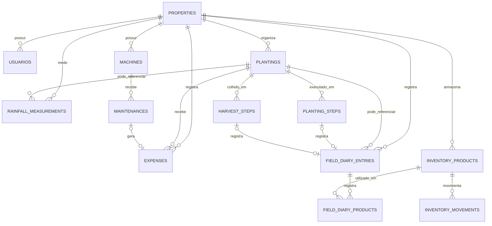

# Modelo do banco de dados

Este arquivo resume o banco atual do AgroGestor. As migrations em `src/main/resources/db/migration` continuam sendo a fonte oficial da estrutura.

## Relações principais

```mermaid
erDiagram
    PROPERTIES ||--o{ USUARIOS : possui
    PROPERTIES ||--o{ PLANTINGS : organiza
    PROPERTIES ||--o{ EXPENSES : registra
    PROPERTIES ||--o{ INVENTORY_PRODUCTS : armazena
    PROPERTIES ||--o{ MACHINES : possui
    PROPERTIES ||--o{ FIELD_DIARY_ENTRIES : registra
    PROPERTIES ||--o{ RAINFALL_MEASUREMENTS : mede
    PLANTINGS ||--o{ EXPENSES : recebe
    PLANTINGS ||--o{ PLANTING_STEPS : executado_em
    PLANTINGS ||--o{ HARVEST_STEPS : colhido_em
    PLANTINGS ||--o{ FIELD_DIARY_ENTRIES : pode_referenciar
    PLANTING_STEPS o|--o| FIELD_DIARY_ENTRIES : registra
    HARVEST_STEPS o|--o| FIELD_DIARY_ENTRIES : registra
    PLANTINGS ||--o{ RAINFALL_MEASUREMENTS : pode_referenciar
    FIELD_DIARY_ENTRIES ||--o{ FIELD_DIARY_PRODUCTS : registra
    INVENTORY_PRODUCTS ||--o{ FIELD_DIARY_PRODUCTS : utilizado_em
    INVENTORY_PRODUCTS ||--o{ INVENTORY_MOVEMENTS : movimenta
    MACHINES ||--o{ MAINTENANCES : recebe
    MAINTENANCES o|--o| EXPENSES : gera
```

## Tabelas em uso

### `usuarios`

Armazena nome, e-mail normalizado, hash da senha, perfil de acesso e a propriedade da conta. O e-mail possui unicidade sem diferenciar letras maiúsculas e minúsculas.

### `properties`

Representa o limite de isolamento dos dados. Cada conta criada atualmente recebe sua própria propriedade, e os módulos operacionais usam `property_id` nas consultas e relacionamentos.

### `plantings`

Guarda cultura, safra, talhão, área total prevista, distância entre linhas em centímetros, data de início, variedade da semente, taxa de semeadura e status. A taxa é registrada por hectare com uma unidade explícita: quilogramas por hectare (`KILOGRAMS_PER_HECTARE`) ou sementes por hectare (`SEEDS_PER_HECTARE`). A medida em quilogramas aceita decimais; a medida em sementes exige um número inteiro. A safra aceita um ano (`2026`) ou um intervalo (`2026/2027`).

A distância entre linhas é opcional para preservar os cadastros anteriores e atender culturas com diferentes configurações de semeadura.

A unidade da taxa de semeadura permanece nula somente nos registros criados antes dessa padronização. Ao editar um desses registros, o usuário deve escolher a unidade correta, pois não é seguro deduzi-la apenas pela cultura ou pelo valor antigo.

A coluna física `seed_quantity` foi mantida por compatibilidade com versões anteriores, mas a aplicação a expõe como `seedRate`, pois o valor representa uma taxa por hectare nos novos cadastros.

O campo de status separa plantios ativos de plantios colhidos, permitindo manter histórico sem apagar dados financeiros ou operacionais.

### `planting_steps`

Registra cada etapa executada da semeadura com data, hectares plantados, variedade utilizada, horários e observações. Um mesmo plantio pode, portanto, ter variedades diferentes em etapas distintas. A soma das etapas determina a área efetivamente plantada, a área restante e o percentual de progresso, sem encerrar o ciclo da cultura quando atingir 100%.

A variedade informada no cadastro do plantio funciona como planejamento e sugestão para novas etapas. Os registros anteriores à inclusão desse campo foram preenchidos automaticamente com essa variedade planejada.

Cada nova etapa pode manter o identificador do lançamento criado automaticamente no Diário. Esse vínculo permite editar ou excluir o registro relacionado sem gerar duplicidades.

### `harvest_steps`

Registra a colheita realizada em cada dia com área, quantidade produzida, unidade, variedade, horários e observações. A soma das áreas é limitada à área efetivamente plantada, não à área inicialmente prevista.

As quantidades podem ser informadas em sacas de 60 kg, quilogramas ou toneladas. O fechamento converte essas unidades para sacas de 60 kg antes de calcular a receita estimada, enquanto o detalhe do plantio apresenta a produtividade média em sacas por hectare.

Cada etapa cria um lançamento de colheita no Diário dentro da mesma transação. Edições e exclusões atualizam o lançamento relacionado, evitando duplicidade. A safra somente pode ser enviada ao histórico depois que toda a área plantada estiver colhida.

### `expenses`

Registra os desembolsos financeiros e os custos atribuídos a um plantio. O campo `origin` diferencia um gasto lançado manualmente (`DIRECT`), uma transferência de custo já reconhecido na compra do estoque (`STOCK_ALLOCATION`) e um custo gerado por manutenção de máquina (`MAINTENANCE`). Assim, o custo do insumo aparece na safra em que foi usado sem aumentar novamente o total pago pela propriedade.

Custos com origem no estoque são gerenciados pelo lançamento correspondente no Diário. Gastos de manutenção são gerenciados no módulo de Máquinas, de modo que editar ou excluir a manutenção também atualiza o financeiro. O vínculo com o plantio usa restrição para evitar exclusão acidental de uma safra com histórico de custos.

### `inventory_products`

Mantém o saldo atual de sementes, fertilizantes, defensivos e outros insumos. Também guarda unidade de medida, estoque mínimo, validade e o valor financeiro ainda armazenado. O custo médio é calculado dividindo `inventory_value` pela quantidade disponível. Quantidade, valor e limite mínimo não podem ser negativos.

### `inventory_movements`

Registra entradas e saídas do estoque, incluindo custo unitário e custo total no momento da movimentação. A atualização do saldo, do valor financeiro e a criação da movimentação acontecem dentro da mesma transação.

### `inventory_valuation_adjustments`

Mantém a auditoria das correções no custo médio do saldo atual, com valor anterior, valor novo, data e motivo. O ajuste recalcula somente o valor financeiro ainda em estoque; custos já registrados em movimentações, Diário e plantios não são alterados.

### `field_diary_entries`

Centraliza acontecimentos da propriedade. O plantio é opcional para registros gerais, como compra de produto, chuva, manutenção ou observação. Etapas de semeadura e colheita exigem um plantio e são gravadas pelos serviços operacionais correspondentes, que atualizam o Diário e o progresso na mesma transação.

Essa tabela também guarda data, tipo de atividade, condição do tempo, descrição e observações.

### `field_diary_products`

Relaciona uma atividade do diário aos produtos do estoque. Guarda a quantidade, o tipo de movimento e o custo utilizado naquela operação. Na compra, aumenta quantidade e valor do saldo; no uso vinculado a um plantio, baixa o estoque e transfere o custo proporcional para a safra.

### `rainfall_measurements`

Guarda medições manuais de chuva em milímetros. O registro pode ser geral da propriedade ou vinculado a um plantio.

### `machines`

Armazena marca, modelo, ano e horímetro atual da máquina.

### `maintenances`

Registra manutenção preventiva ou corretiva, peças trocadas, custo e horímetro previsto para a próxima revisão. Quando existe custo, `expense_id` identifica o gasto geral criado automaticamente; o vínculo permite manter os dois módulos sincronizados sem duplicar lançamentos feitos pelo Diário.

### `weather_location`

Tabela mantida por compatibilidade com migrations antigas. O módulo de previsão do tempo está pausado e a aplicação não consulta essa tabela no fluxo atual.

### `idempotency_records`

Guarda temporariamente a chave, a rota e a resposta de operações mutáveis enviadas pelo PWA. Isso permite devolver a mesma resposta quando a fila repete um envio já concluído. Os registros expiram automaticamente depois de 90 dias; dados de negócio não são removidos por essa limpeza.

## Convenções

- IDs usam UUID.
- Valores financeiros e quantidades usam `NUMERIC`.
- Datas operacionais usam `DATE`.
- Datas de auditoria usam `TIMESTAMPTZ`.
- Mudanças estruturais entram somente por novas migrations do Flyway.
- Migrations já aplicadas não devem ser reescritas ou removidas.
- Consultas de plantios ativos, gastos por safra e Diário por plantio usam índices compostos compatíveis com a ordenação apresentada no aplicativo.
- Vínculos de chuva e manutenção gerados pelo Diário possuem índices parciais para validar sua origem sem varrer todo o histórico.

## Próximas evoluções de banco

- Permitir que mais de um usuário trabalhe na mesma propriedade com permissões diferentes.
- Criar tabelas de backup/exportação, caso o sistema evolua para uso local/offline.
- Persistir relatórios de fechamento de safra quando houver necessidade de auditoria histórica.
